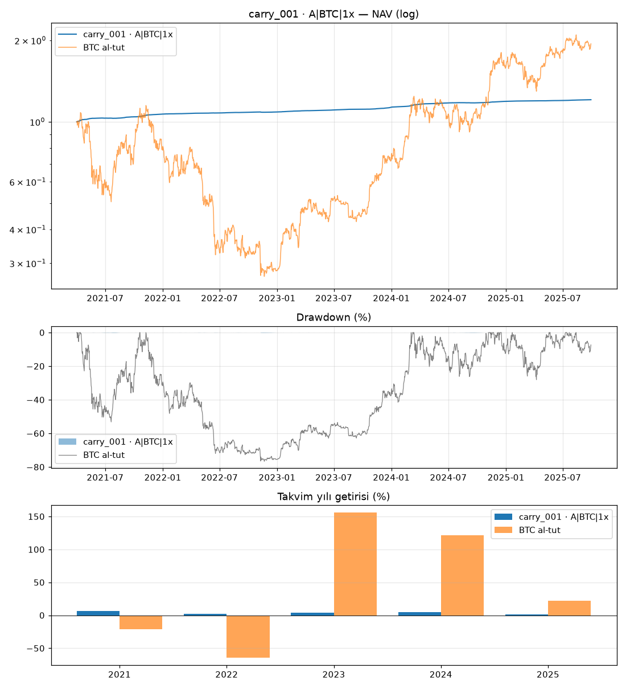

# carry_001 · A|BTC|1x

Dönem: 2021-04-01 → 2025-09-29 (1643 gün)

| Metrik | Strateji | BTC al-tut |
|---|---|---|
| Yıllık getiri | 4.27% | 15.90% |
| Yıllık vol | 0.43% | 56.93% |
| Sharpe | 9.76 | 0.54 |
| Sortino | 25.95 | 0.79 |
| Calmar | 16.36 | 0.21 |
| Maks. drawdown | -0.26% | -76.67% |
| Maks. DD süresi (gün) | 74 | 846 |

BTC'ye beta: -0.00 · korelasyon: -0.11

Takvim yılı getirileri: 2021: 6.8%, 2022: 1.9%, 2023: 4.1%, 2024: 5.1%, 2025: 1.4%

## Ek bilgiler

- **karar**: KALDI (min_return)
- **PBO**: 0.07

