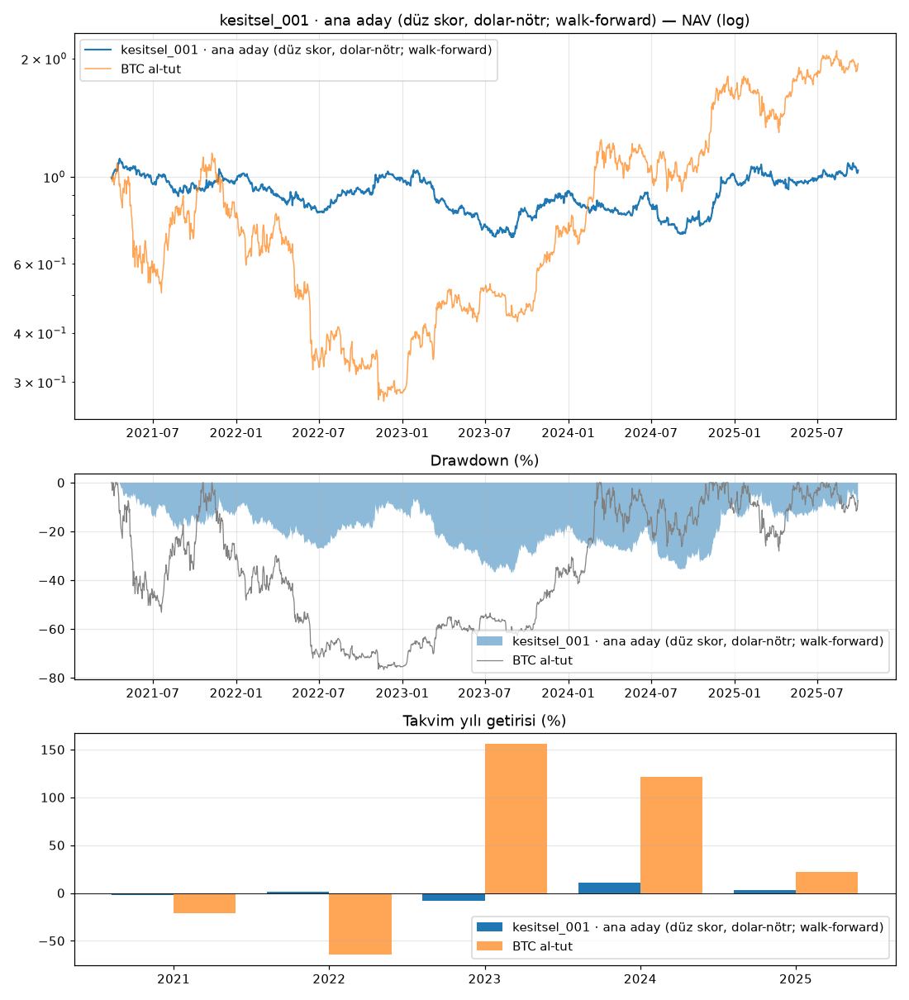

# kesitsel_001 · ana aday (düz skor, dolar-nötr; walk-forward)

Dönem: 2021-04-01 → 2025-09-29 (1643 gün)

| Metrik | Strateji | BTC al-tut |
|---|---|---|
| Yıllık getiri | 0.84% | 15.90% |
| Yıllık vol | 20.71% | 56.92% |
| Sharpe | 0.14 | 0.54 |
| Sortino | 0.21 | 0.79 |
| Calmar | 0.02 | 0.21 |
| Maks. drawdown | -36.99% | -76.66% |
| Maks. DD süresi (gün) | 1624 | 846 |

BTC'ye beta: -0.03 · korelasyon: -0.09

Takvim yılı getirileri: 2021: -2.0%, 2022: 1.2%, 2023: -8.3%, 2024: 11.0%, 2025: 2.9%

## Ek bilgiler

- **karar**: KALDI (net_sharpe, deflated_sharpe, max_drawdown, calmar, stress, plateau)
- **PBO**: 0.24
- **DSR**: 0.01

