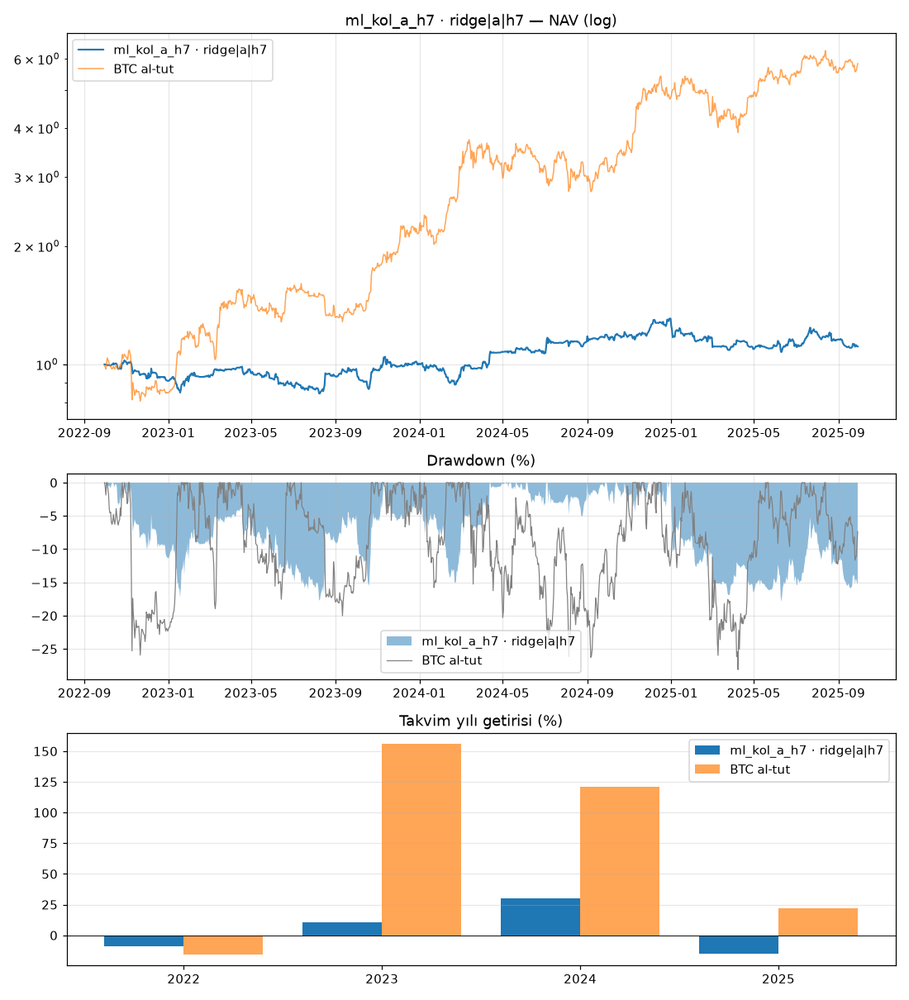

# ml_kol_a_h7 · ridge|a|h7

Dönem: 2022-09-30 → 2025-09-29 (1096 gün)

| Metrik | Strateji | BTC al-tut |
|---|---|---|
| Yıllık getiri | 3.55% | 79.93% |
| Yıllık vol | 19.10% | 47.46% |
| Sharpe | 0.28 | 1.47 |
| Sortino | 0.41 | 2.33 |
| Calmar | 0.20 | 2.84 |
| Maks. drawdown | -17.93% | -28.10% |
| Maks. DD süresi (gün) | 376 | 237 |

BTC'ye beta: -0.02 · korelasyon: -0.04

Takvim yılı getirileri: 2022: -9.2%, 2023: 10.7%, 2024: 30.1%, 2025: -15.1%

## Ek bilgiler

- **geçerli**: True
- **uyarılar**: yok
- **başarısız testler**: yok
- **birincil model**: ridge|a|h7
- **PBO**: 0.81
- **stres Sharpe (ücret×2, kayma×3)**: -0.29
- **+1 bar gecikme Sharpe**: 0.94
- **hesap**: 250 USDT, 3x, lot: nearest
- **lot yuvarlaması (gerçekleşen emirlerde Σ|yuvarlanmış|/Σ|hedef|)**: 1.18
- **1x için önerilen asgari hesap**: 571 USDT (BTCUSDT en küçük lotu, varlık tavanı %20; fiyat tarihi 2025-09-30)
- **IC[ridge|a|h7]**: -0.018 (t=-1.4)
- **IC[lightgbm_reg|a|h7]**: 0.019 (t=1.5)
- **IC[xgboost_reg|a|h7]**: 0.017 (t=1.3)

