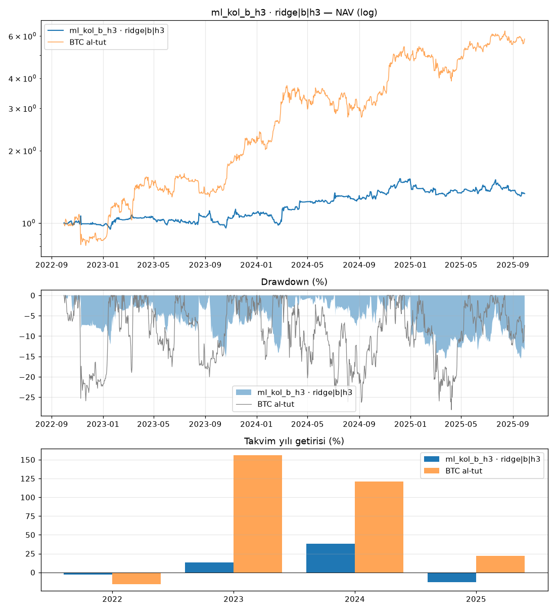

# ml_kol_b_h3 · ridge|b|h3

Dönem: 2022-09-30 → 2025-09-29 (1096 gün)

| Metrik | Strateji | BTC al-tut |
|---|---|---|
| Yıllık getiri | 9.82% | 79.93% |
| Yıllık vol | 20.07% | 47.46% |
| Sharpe | 0.57 | 1.47 |
| Sortino | 0.85 | 2.33 |
| Calmar | 0.63 | 2.84 |
| Maks. drawdown | -15.58% | -28.10% |
| Maks. DD süresi (gün) | 296 | 237 |

BTC'ye beta: -0.03 · korelasyon: -0.08

Takvim yılı getirileri: 2022: -2.7%, 2023: 13.4%, 2024: 38.0%, 2025: -12.9%

## Ek bilgiler

- **geçerli**: True
- **uyarılar**: yok
- **başarısız testler**: yok
- **birincil model**: ridge|b|h3
- **PBO**: 0.57
- **stres Sharpe (ücret×2, kayma×3)**: -0.09
- **+1 bar gecikme Sharpe**: 0.13
- **hesap**: 250 USDT, 3x, lot: nearest
- **lot yuvarlaması (gerçekleşen emirlerde Σ|yuvarlanmış|/Σ|hedef|)**: 1.16
- **1x için önerilen asgari hesap**: 571 USDT (BTCUSDT en küçük lotu, varlık tavanı %20; fiyat tarihi 2025-09-30)
- **IC[ridge|b|h3]**: -0.018 (t=-2.0)
- **IC[lightgbm_reg|b|h3]**: 0.018 (t=2.2)
- **IC[xgboost_reg|b|h3]**: 0.020 (t=2.3)

