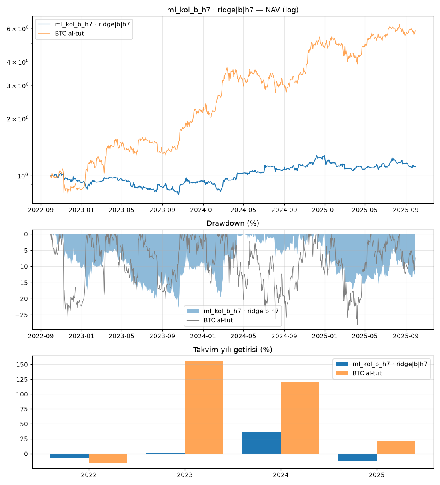

# ml_kol_b_h7 · ridge|b|h7

Dönem: 2022-09-30 → 2025-09-29 (1096 gün)

| Metrik | Strateji | BTC al-tut |
|---|---|---|
| Yıllık getiri | 3.75% | 79.93% |
| Yıllık vol | 19.31% | 47.46% |
| Sharpe | 0.29 | 1.47 |
| Sortino | 0.42 | 2.33 |
| Calmar | 0.16 | 2.84 |
| Maks. drawdown | -22.82% | -28.10% |
| Maks. DD süresi (gün) | 531 | 237 |

BTC'ye beta: 0.01 · korelasyon: 0.03

Takvim yılı getirileri: 2022: -7.9%, 2023: 2.0%, 2024: 35.9%, 2025: -12.5%

## Ek bilgiler

- **geçerli**: True
- **uyarılar**: yok
- **başarısız testler**: yok
- **birincil model**: ridge|b|h7
- **PBO**: 0.77
- **stres Sharpe (ücret×2, kayma×3)**: -0.29
- **+1 bar gecikme Sharpe**: 0.71
- **hesap**: 250 USDT, 3x, lot: nearest
- **lot yuvarlaması (gerçekleşen emirlerde Σ|yuvarlanmış|/Σ|hedef|)**: 1.18
- **1x için önerilen asgari hesap**: 571 USDT (BTCUSDT en küçük lotu, varlık tavanı %20; fiyat tarihi 2025-09-30)
- **IC[ridge|b|h7]**: -0.022 (t=-1.7)
- **IC[lightgbm_reg|b|h7]**: 0.007 (t=0.6)
- **IC[xgboost_reg|b|h7]**: 0.007 (t=0.5)

