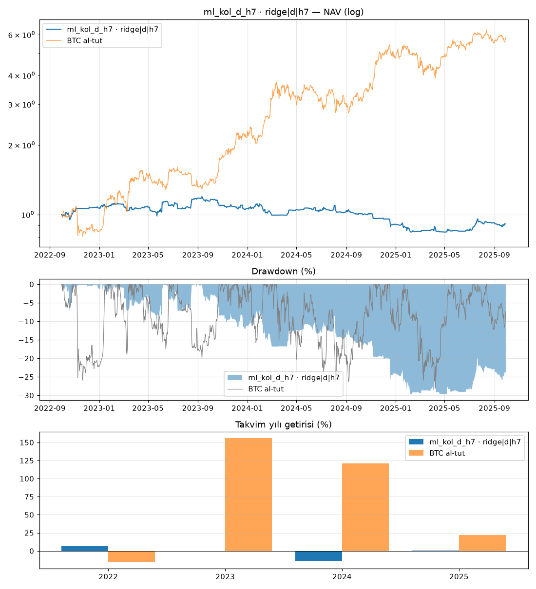

# ml_kol_d_h7 · ridge|d|h7

Dönem: 2022-09-30 → 2025-09-29 (1096 gün)

| Metrik | Strateji | BTC al-tut |
|---|---|---|
| Yıllık getiri | -3.05% | 79.93% |
| Yıllık vol | 15.64% | 47.46% |
| Sharpe | -0.12 | 1.47 |
| Sortino | -0.18 | 2.33 |
| Calmar | -0.10 | 2.84 |
| Maks. drawdown | -29.75% | -28.10% |
| Maks. DD süresi (gün) | 749 | 237 |

BTC'ye beta: -0.03 · korelasyon: -0.10

Takvim yılı getirileri: 2022: 6.7%, 2023: -0.5%, 2024: -14.5%, 2025: 0.3%

## Ek bilgiler

- **geçerli**: True
- **uyarılar**: yok
- **başarısız testler**: yok
- **birincil model**: ridge|d|h7
- **PBO**: 0.88
- **stres Sharpe (ücret×2, kayma×3)**: -0.87
- **+1 bar gecikme Sharpe**: -0.25
- **hesap**: 250 USDT, 3x, lot: nearest
- **lot yuvarlaması (gerçekleşen emirlerde Σ|yuvarlanmış|/Σ|hedef|)**: 1.14
- **1x için önerilen asgari hesap**: 571 USDT (BTCUSDT en küçük lotu, varlık tavanı %20; fiyat tarihi 2025-09-30)
- **IC[ridge|d|h7]**: -0.032 (t=-2.4)
- **IC[lightgbm_reg|d|h7]**: 0.022 (t=1.8)
- **IC[xgboost_reg|d|h7]**: 0.003 (t=0.3)

