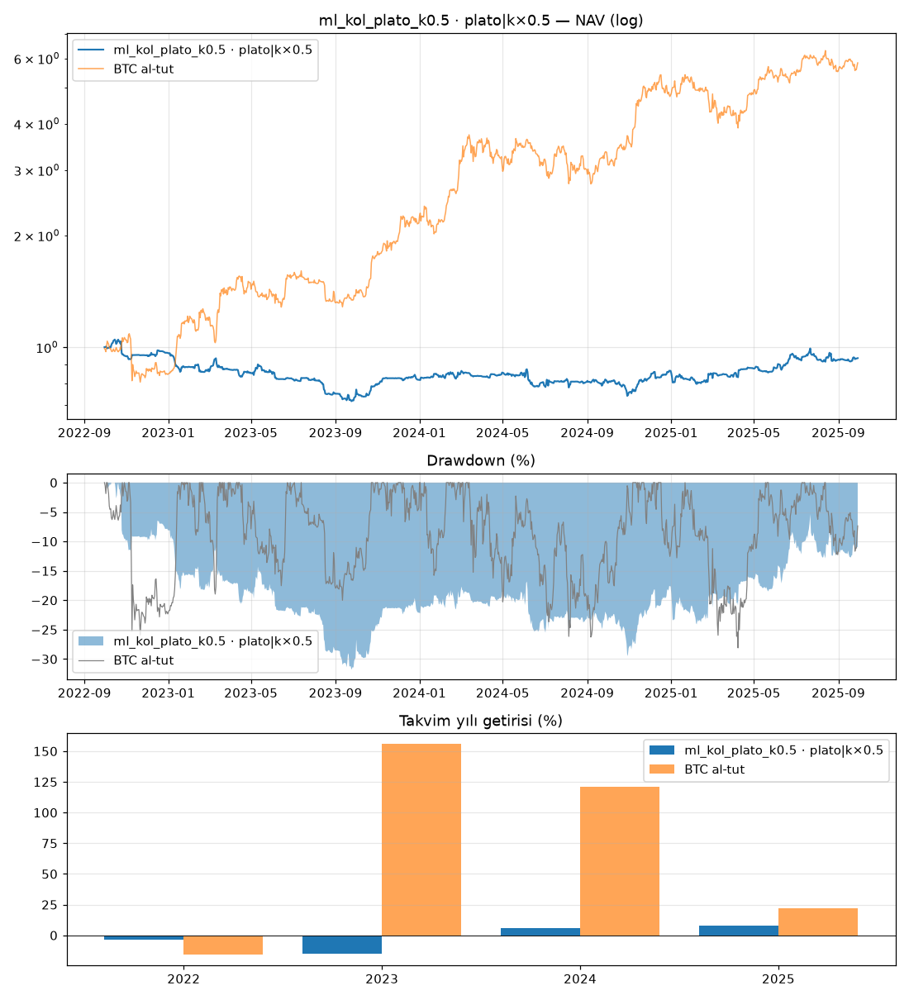

# ml_kol_plato_k0.5 · plato|k×0.5

Dönem: 2022-09-30 → 2025-09-29 (1096 gün)

| Metrik | Strateji | BTC al-tut |
|---|---|---|
| Yıllık getiri | -2.23% | 79.93% |
| Yıllık vol | 16.58% | 47.46% |
| Sharpe | -0.05 | 1.47 |
| Sortino | -0.07 | 2.33 |
| Calmar | -0.07 | 2.84 |
| Maks. drawdown | -31.79% | -28.10% |
| Maks. DD süresi (gün) | 1080 | 237 |

BTC'ye beta: -0.02 · korelasyon: -0.07

Takvim yılı getirileri: 2022: -3.5%, 2023: -15.3%, 2024: 5.7%, 2025: 8.2%

## Ek bilgiler

- **geçerli**: True
- **uyarılar**: yok
- **başarısız testler**: yok
- **birincil model**: plato|k×0.5
- **PBO**: —
- **stres Sharpe (ücret×2, kayma×3)**: -0.77
- **+1 bar gecikme Sharpe**: -0.23
- **hesap**: 250 USDT, 3x, lot: nearest
- **lot yuvarlaması (gerçekleşen emirlerde Σ|yuvarlanmış|/Σ|hedef|)**: 1.12
- **1x için önerilen asgari hesap**: 571 USDT (BTCUSDT en küçük lotu, varlık tavanı %20; fiyat tarihi 2025-09-30)
- **IC[plato|k×0.5]**: 0.007 (t=0.6)

