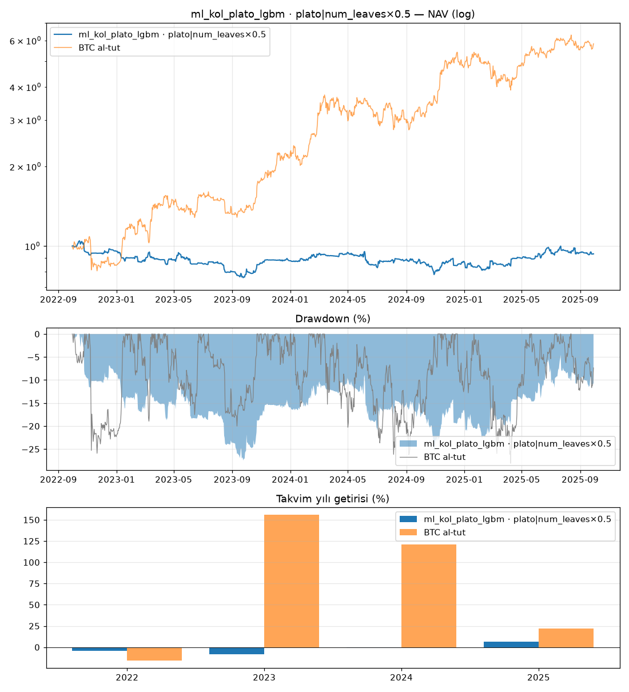

# ml_kol_plato_lgbm · plato|num_leaves×0.5

Dönem: 2022-09-30 → 2025-09-29 (1096 gün)

| Metrik | Strateji | BTC al-tut |
|---|---|---|
| Yıllık getiri | -2.24% | 79.93% |
| Yıllık vol | 16.92% | 47.46% |
| Sharpe | -0.05 | 1.47 |
| Sortino | -0.07 | 2.33 |
| Calmar | -0.08 | 2.84 |
| Maks. drawdown | -27.48% | -28.10% |
| Maks. DD süresi (gün) | 1080 | 237 |

BTC'ye beta: -0.02 · korelasyon: -0.05

Takvim yılı getirileri: 2022: -4.3%, 2023: -8.1%, 2024: -0.6%, 2025: 6.8%

## Ek bilgiler

- **geçerli**: True
- **uyarılar**: yok
- **başarısız testler**: yok
- **birincil model**: plato|num_leaves×0.5
- **PBO**: 0.41
- **stres Sharpe (ücret×2, kayma×3)**: -0.81
- **+1 bar gecikme Sharpe**: -0.17
- **hesap**: 250 USDT, 3x, lot: nearest
- **lot yuvarlaması (gerçekleşen emirlerde Σ|yuvarlanmış|/Σ|hedef|)**: 1.12
- **1x için önerilen asgari hesap**: 571 USDT (BTCUSDT en küçük lotu, varlık tavanı %20; fiyat tarihi 2025-09-30)
- **IC[plato|num_leaves×0.5]**: 0.005 (t=0.4)
- **IC[plato|num_leaves×1.5]**: 0.009 (t=0.7)
- **IC[plato|learning_rate×0.5]**: 0.010 (t=0.7)
- **IC[plato|learning_rate×1.5]**: 0.004 (t=0.3)

