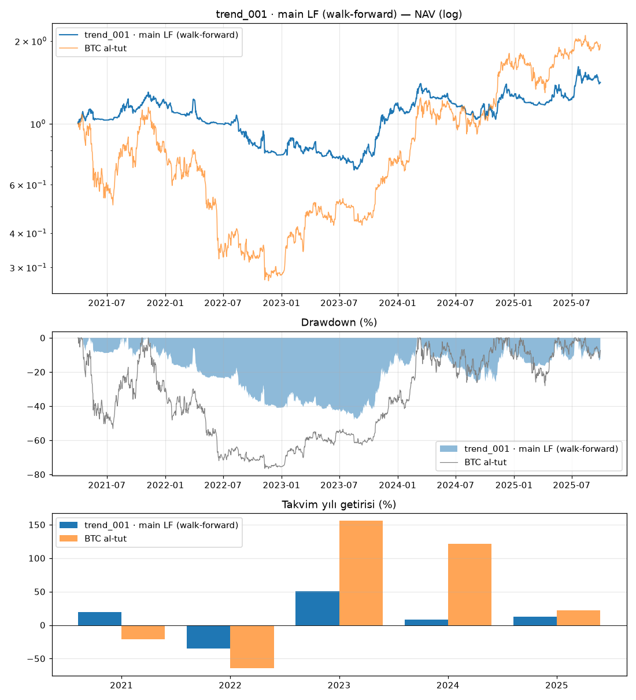

# trend_001 · main LF (walk-forward)

Dönem: 2021-04-01 → 2025-09-29 (1643 gün)

| Metrik | Strateji | BTC al-tut |
|---|---|---|
| Yıllık getiri | 8.01% | 15.90% |
| Yıllık vol | 25.92% | 56.92% |
| Sharpe | 0.43 | 0.54 |
| Sortino | 0.60 | 0.79 |
| Calmar | 0.17 | 0.21 |
| Maks. drawdown | -47.89% | -76.66% |
| Maks. DD süresi (gün) | 844 | 846 |

BTC'ye beta: 0.27 · korelasyon: 0.60

Takvim yılı getirileri: 2021: 19.2%, 2022: -35.3%, 2023: 51.0%, 2024: 7.9%, 2025: 12.6%

## Ek bilgiler

- **karar**: KALDI (net_sharpe, deflated_sharpe, pbo, max_drawdown, calmar, stress)
- **PBO**: 0.50
- **DSR**: 0.31

