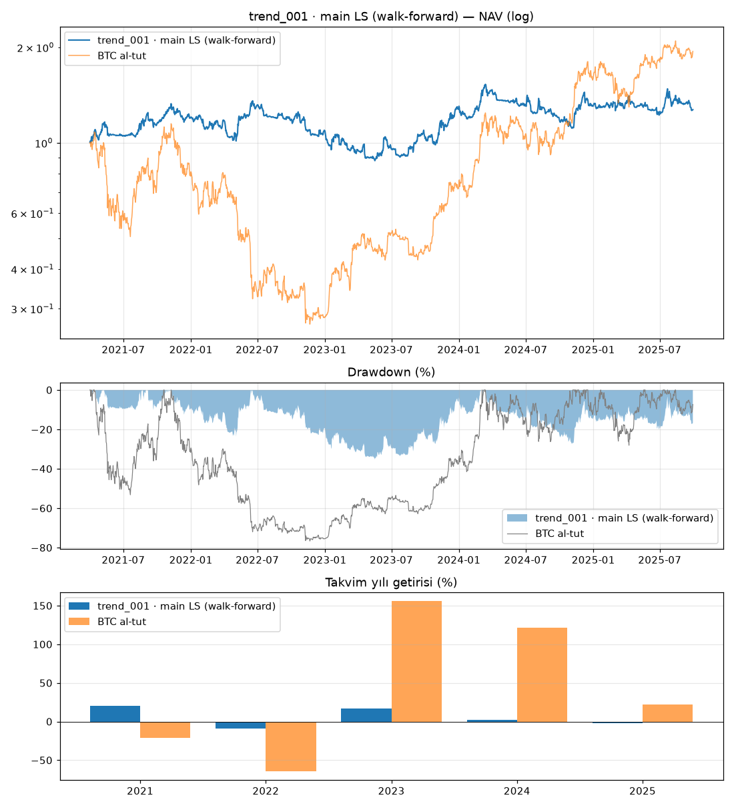

# trend_001 · main LS (walk-forward)

Dönem: 2021-04-01 → 2025-09-29 (1643 gün)

| Metrik | Strateji | BTC al-tut |
|---|---|---|
| Yıllık getiri | 5.51% | 15.90% |
| Yıllık vol | 25.24% | 56.92% |
| Sharpe | 0.34 | 0.54 |
| Sortino | 0.48 | 0.79 |
| Calmar | 0.16 | 0.21 |
| Maks. drawdown | -35.25% | -76.66% |
| Maks. DD süresi (gün) | 621 | 846 |

BTC'ye beta: 0.03 · korelasyon: 0.07

Takvim yılı getirileri: 2021: 20.3%, 2022: -9.0%, 2023: 16.5%, 2024: 2.3%, 2025: -2.4%

## Ek bilgiler

- **karar**: KALDI (net_sharpe, deflated_sharpe, pbo, max_drawdown, calmar, stress, plateau)
- **PBO**: 0.50
- **DSR**: 0.24

